# Intelligent Report Generator (Template Agent)

An intelligent report generation system based on templates and knowledge bases, supporting automatic generation of structured reports from Markdown or JSON templates.

## Features

- 🤖 **Intelligent Content Generation**: Automatically generate report content based on predefined templates
- 📚 **Knowledge Base Retrieval**: Automatically retrieve relevant information from document libraries
- 🔄 **Format Conversion**: Support bidirectional conversion between Markdown and JSON formats
- ⚡ **Parallel Processing**: Support parallel section generation for improved efficiency
- 📊 **Progress Tracking**: Real-time tracking of generation progress
- 🎯 **Flexible Configuration**: Support multiple models and API configurations

## System Architecture

```mermaid
flowchart TD
      A[User inputs documents and templates] --> B[ReportGeneratorAgent initialization]
      B --> C[Load template content]
      C --> D{Template format?}
      D -->|Markdown| E[Convert to JSON structure]
      D -->|JSON| F[Parse JSON directly]
      E --> G[Initialize report structure]
      F --> G
      G --> H[Create SectionAgent instances]
      H --> I[Start report generation]

      subgraph Report Generation Phase
      I --> J{Generation mode?}
      J -->|Serial mode| K[Generate sections in order]
      J -->|Parallel mode| L[Generate sections concurrently]

      K --> M[Select next section]
      M --> N[Run SectionAgent]
      N --> O[Retrieve information from knowledge base]
      O --> P[Generate section content]
      P --> Q[Update section status]
      Q --> R{More sections?}
      R -->|Yes| M

      L --> S[Create concurrent tasks]
      S --> T[Run multiple SectionAgents simultaneously]
      T --> U[Wait for all tasks to complete]
      U --> V[Process concurrent results]
      V --> W{More sections?}
      W -->|Yes| L
      end

      R -->|No| X{Enable polishing?}
      W -->|No| X
      X -->|No| Y[Save report]
      X -->|Yes| Z[Content quality assessment]

      subgraph Content Polishing Phase
      Z --> AA[Identify quality issues]
      AA --> BB{Quality issues?}
      BB -->|Yes| CC[Content polishing optimization]
      BB -->|No| DD[Consistency check]
      CC --> DD
      DD --> EE{Consistency issues?}
      EE -->|Yes| FF[Fix consistency issues]
      EE -->|No| GG[Final quality check]
      FF --> GG
      GG --> HH{Quality passed?}
      HH -->|Yes| II[Mark polishing complete]
      HH -->|No| JJ[Record quality issues]
      JJ --> II
      end

      II --> Y
      Y --> KK[Generate JSON format]
      KK --> LL[Convert to Markdown]
      LL --> MM[Save to file]
      MM --> NN[Return generation results]

      style A fill:#e1f5fe
      style NN fill:#c8e6c9
      style Z fill:#fff3e0
      style Y fill:#f3e5f5
```



## Quick Start

### Requirements

- Python >= 3.11
- OpenAI API Key or compatible API service

### Install Dependencies

```bash
pip install -e .
```

### Environment Configuration

1. Copy the environment configuration file:
```bash
cp .env.example .env
```

2. Edit the `.env` file to configure API information:
```env
OPENAI_API_BASE=https://api.openai.com/v1
OPENAI_API_KEY=your_openai_api_key_here
LLM_MODEL=gpt-3.5-turbo
LLM_MAX_TOKENS=4096

EMBEDDING_MODEL=text-embedding-3-small
EMBEDDING_MAX_TOKENS=8192
EMBEDDING_DIM=1536
```

### Basic Usage

#### 1. List available templates
```bash
python main.py list
```

#### 2. Generate reports
```bash
python main.py generate --template 产品需求评审会议.md --output report.md --format markdown --knowledge-base workdir/documents 
```

#### 3. Test knowledge base
```bash
python main.py test --query "smart insoles"
```

#### 4. Convert template format
```bash
python main.py convert --template "template.md" --format json
```

## Command Line Arguments

| Parameter | Description | Default |
|-----------|-------------|---------|
| `action` | Action to execute: generate/convert/test/list | Required |
| `--template, -t` | Template name or path | - |
| `--output, -o` | Output filename | Auto-generated |
| `--format, -f` | Target conversion format: json/markdown | json |
| `--query, -q` | Test query content | "smart insoles" |
| `--max-steps` | Maximum execution steps | 20 |
| `--knowledge-base` | Knowledge base path | workdir/documents |
| `--template-base` | Template base path | workdir/template |

## Directory Structure

```
template-agent/
├── app/                      # Core application code
│   ├── agent/               # Agent-related modules
│   │   ├── base.py         # Base Agent class
│   │   ├── react.py        # ReAct mode Agent
│   │   ├── toolcall.py     # Tool call Agent
│   │   ├── section_agent.py # Section generation Agent
│   │   └── report_generator.py # Report generation Agent
│   ├── tool/               # Tool modules
│   │   ├── base.py         # Base tool class
│   │   ├── knowledge_retrieval.py # Knowledge retrieval tool
│   │   ├── create_chat_completion.py # LLM call tool
│   │   └── terminate.py    # Termination tool
│   ├── prompt/             # Prompt templates
│   ├── config.py           # Configuration management
│   ├── converter.py        # Format converter
│   ├── llm.py             # LLM client
│   ├── logger.py          # Logging configuration
│   ├── schema.py          # Data models
│   ├── type.py            # Type definitions
│   └── exceptions.py      # Exception handling
├── workdir/                # Working directory
│   ├── documents/          # Knowledge base documents
│   ├── template/           # Report templates
│   └── output/             # Generated results
├── main.py                 # Program entry point
├── pyproject.toml          # Project configuration
├── requirements.txt        # Dependency list
└── .env.example           # Environment configuration example
```

## Core Components

### ReportGeneratorAgent
The main report generation agent responsible for:
- Template parsing and validation
- Section task allocation
- Generation progress tracking
- Result aggregation and saving

### SectionAgent  
Section generation agent responsible for:
- Individual section content generation
- Knowledge base information retrieval
- Content quality control

### KnowledgeRetrievalTool
Knowledge retrieval tool supporting:
- Semantic search
- Keyword matching
- Relevance ranking

### MarkdownConverter
Format converter supporting:
- Markdown ↔ JSON bidirectional conversion
- Structured data extraction
- Metadata preservation

## Configuration Options

### LLM Settings
- `model`: Model name
- `base_url`: API base URL
- `api_key`: API key
- `max_tokens`: Maximum tokens
- `temperature`: Sampling temperature

### Embedding Model Settings
- `EMBEDDING_MODEL`: Embedding model name
- `EMBEDDING_PROVIDER`: Provider (openai/hf/ollama)
- `EMBEDDING_DIM`: Vector dimension
- `EMBEDDING_MAX_TOKEN_SIZE`: Maximum token size

### Generation Settings
- `parallel_sections`: Whether to generate sections in parallel
- `max_concurrent`: Maximum concurrency

## Usage Examples

### Create Custom Templates

1. Create a Markdown template in the `workdir/template/` directory:

```markdown
# Product Requirements Review Meeting

## Basic Meeting Information
- Meeting time:
- Attendees:
- Meeting objectives:

## Product Requirements Overview
### Requirements Background
<!-- Please describe the background and reasons for the product requirements -->

### Core Features
<!-- Please list the core feature points -->

## Technical Review
### Technical Feasibility
<!-- Evaluate technical implementation difficulty -->

### Resource Requirements
<!-- Evaluate required resources -->

## Risk Assessment
### Technical Risks
<!-- Identify technical risks -->

### Time Risks  
<!-- Evaluate time risks -->

## Decision Results
### Final Decision
<!-- Meeting decision results -->

### Follow-up Actions
<!-- Follow-up action plan -->
```

2. Run the generation command:
```bash
python main.py generate --template "Product_Requirements_Review_Meeting.md"
```

### Add Knowledge Base Documents

Place relevant documents in the `workdir/documents/` directory, and the system will automatically index and retrieve them.

## Development Guide

### Extend New Tools

1. Create a new tool class in the `app/tool/` directory
2. Inherit from the `BaseTool` class
3. Implement the `execute` method
4. Register the tool in the Agent

### Custom Agent

1. Inherit from the `BaseAgent` class
2. Implement necessary methods
3. Configure tools and prompts
