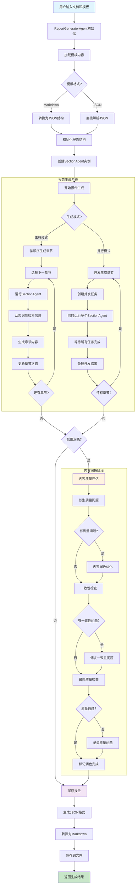

# 智能报告生成器 (Template Agent)

基于模板和知识库的智能报告生成系统，支持从Markdown或JSON模板自动生成结构化报告。

## 功能特性

- 🤖 **智能内容生成**：基于预定义模板自动生成报告内容
- 📚 **知识库检索**：自动从文档库中检索相关信息
- 🔄 **格式转换**：支持Markdown和JSON格式互转
- ⚡ **并行处理**：支持章节并行生成，提高效率
- 📊 **进度跟踪**：实时跟踪生成进度
- 🎯 **灵活配置**：支持多种模型和API配置

## 系统架构



## 快速开始

### 环境要求

- Python >= 3.11
- OpenAI API Key 或兼容的API服务

### 安装依赖

```bash
pip install -e .
```

### 环境配置

1. 复制环境配置文件：
```bash
cp .env.example .env
```

2. 编辑 `.env` 文件，配置API信息：
```env
OPENAI_API_BASE=https://api.openai.com/v1
OPENAI_API_KEY=your_openai_api_key_here
LLM_MODEL=gpt-3.5-turbo
LLM_MAX_TOKENS=4096

EMBEDDING_MODEL=text-embedding-3-small
EMBEDDING_MAX_TOKENS=8192
EMBEDDING_DIM=1536
```

### 基本用法

#### 1. 列出可用模板
```bash
python main.py list
```

#### 2. 生成报告
```bash
python main.py generate --template "会议模板.md" --output "我的会议报告"
```

#### 3. 测试知识库
```bash
python main.py test --query "智能鞋垫"
```

#### 4. 转换模板格式
```bash
python main.py convert --template "模板.md" --format json
```

## 命令行参数

| 参数 | 描述 | 默认值 |
|------|------|--------|
| `action` | 执行操作：generate/convert/test/list | 必需 |
| `--template, -t` | 模板名称或路径 | - |
| `--output, -o` | 输出文件名 | 自动生成 |
| `--format, -f` | 转换目标格式：json/markdown | json |
| `--query, -q` | 测试查询内容 | "智能鞋垫" |
| `--max-steps` | 最大执行步数 | 20 |
| `--knowledge-base` | 知识库路径 | workdir/documents |
| `--template-base` | 模板基础路径 | workdir/template |

## 目录结构

```
template-agent/
├── app/                      # 核心应用代码
│   ├── agent/               # Agent相关模块
│   │   ├── base.py         # 基础Agent类
│   │   ├── react.py        # ReAct模式Agent
│   │   ├── toolcall.py     # 工具调用Agent
│   │   ├── section_agent.py # 章节生成Agent
│   │   └── report_generator.py # 报告生成Agent
│   ├── tool/               # 工具模块
│   │   ├── base.py         # 基础工具类
│   │   ├── knowledge_retrieval.py # 知识检索工具
│   │   ├── create_chat_completion.py # LLM调用工具
│   │   └── terminate.py    # 终止工具
│   ├── prompt/             # 提示词模板
│   ├── config.py           # 配置管理
│   ├── converter.py        # 格式转换器
│   ├── llm.py             # LLM客户端
│   ├── logger.py          # 日志配置
│   ├── schema.py          # 数据模型
│   ├── type.py            # 类型定义
│   └── exceptions.py      # 异常处理
├── workdir/                # 工作目录
│   ├── documents/          # 知识库文档
│   ├── template/           # 报告模板
│   └── output/             # 生成结果
├── main.py                 # 程序入口
├── pyproject.toml          # 项目配置
├── requirements.txt        # 依赖列表
└── .env.example           # 环境配置示例
```

## 核心组件

### ReportGeneratorAgent
主要的报告生成代理，负责：
- 模板解析和验证
- 章节任务分配
- 生成进度跟踪
- 结果汇总和保存

### SectionAgent  
章节生成代理，负责：
- 单个章节内容生成
- 知识库信息检索
- 内容质量控制

### KnowledgeRetrievalTool
知识检索工具，支持：
- 语义搜索
- 关键词匹配
- 相关性排序

### MarkdownConverter
格式转换器，支持：
- Markdown ↔ JSON 互转
- 结构化数据提取
- 元数据保留

## 配置选项

### LLM设置
- `model`: 模型名称
- `base_url`: API基础URL
- `api_key`: API密钥
- `max_tokens`: 最大令牌数
- `temperature`: 采样温度

### 嵌入模型设置
- `EMBEDDING_MODEL`: 嵌入模型名称
- `EMBEDDING_PROVIDER`: 提供商（openai/hf/ollama）
- `EMBEDDING_DIM`: 向量维度
- `EMBEDDING_MAX_TOKEN_SIZE`: 最大令牌大小

### 生成设置
- `parallel_sections`: 是否并行生成章节
- `max_concurrent`: 最大并发数

## 使用示例

### 创建自定义模板

1. 在 `workdir/template/` 目录下创建Markdown模板：

```markdown
# 产品需求评审会议

## 会议基本信息
- 会议时间：
- 参会人员：
- 会议目标：

## 产品需求概述
### 需求背景
<!-- 请描述产品需求的背景和原因 -->

### 核心功能
<!-- 请列出核心功能点 -->

## 技术评审
### 技术可行性
<!-- 评估技术实现难度 -->

### 资源需求
<!-- 评估所需资源 -->

## 风险评估
### 技术风险
<!-- 识别技术风险 -->

### 时间风险  
<!-- 评估时间风险 -->

## 决策结果
### 最终决定
<!-- 会议决策结果 -->

### 后续行动
<!-- 后续行动计划 -->
```

2. 运行生成命令：
```bash
python main.py generate --template "产品需求评审会议.md"
```

### 添加知识库文档

将相关文档放入 `workdir/documents/` 目录，系统会自动索引和检索。

## 开发说明

### 扩展新工具

1. 在 `app/tool/` 目录下创建新工具类
2. 继承 `BaseTool` 类
3. 实现 `execute` 方法
4. 在Agent中注册工具

### 自定义Agent

1. 继承 `BaseAgent` 类
2. 实现必要的方法
3. 配置工具和提示词
