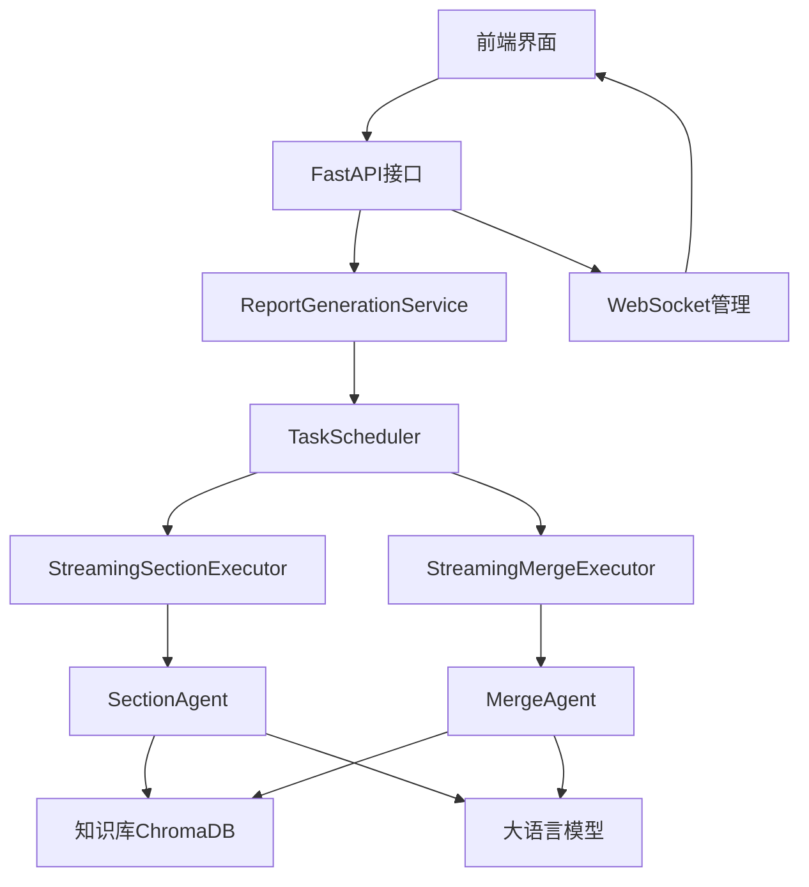

# Template Report Generation Service

一个基于模板的智能报告生成服务，支持并发执行、实时流式输出和前端集成。

## 🚀 核心特性

### 📋 模板化报告生成
- **Markdown模板解析**: 自动解析模板结构，创建任务依赖图
- **智能内容生成**: 基于知识库检索和LLM生成高质量内容  
- **层级结构支持**: 支持多层级标题和复杂文档结构

### ⚡ 高性能执行
- **并发处理**: 可配置的并发执行，最高支持10个并发任务
- **依赖管理**: 自动处理任务间依赖关系，按需调度执行
- **流式输出**: 实时输出生成进度和内容，无需等待全部完成

### 🌐 Web服务支持
- **REST API**: 完整的RESTful接口，支持所有操作
- **WebSocket**: 实时双向通信，支持进度跟踪和流式输出
- **文件上传**: 支持模板和知识库文档上传

### 📊 实时监控
- **任务状态跟踪**: 实时监控每个任务的执行状态
- **进度可视化**: 详细的进度信息，包括完成度、错误信息等
- **连接管理**: WebSocket连接管理和消息广播

## 🏗 架构设计



## 📦 安装依赖

```bash
# 核心依赖
pip install fastapi uvicorn websockets
pip install pydantic pathlib asyncio
pip install click  # CLI支持

# 可选：如果需要前端静态文件服务
pip install jinja2 aiofiles
```

## 🚀 快速开始

### 1. 启动服务

```bash
# 启动API服务器（默认端口8000）
python run_service.py serve

# 自定义端口和主机
python run_service.py serve --host 0.0.0.0 --port 8081 --reload

# 后台运行
nohup python run_service.py serve > service.log 2>&1 &
```

### 2. 直接生成报告（命令行模式）

```bash
# 基本用法
python run_service.py generate workdir/template/企业信贷评估模板.md

# 自定义参数
python run_service.py generate template.md \
    --knowledge-base workdir/documents/finance \
    --concurrent 5 \
    --streaming \
    --model-merge \
    --report-title "自定义报告标题"
```

### 3. 使用API接口

```python
import requests
import json

# 创建任务
response = requests.post('http://localhost:8000/jobs', json={
    "template_path": "workdir/template/企业信贷评估模板.md",
    "knowledge_base_path": "workdir/documents/finance",
    "max_concurrent": 3,
    "enable_streaming": True,
    "enable_model_merge": True,
    "report_title": "企业信贷评估报告"
})

job_data = response.json()
job_id = job_data['job_id']

# 启动任务
requests.post(f'http://localhost:8000/jobs/{job_id}/start')

# 查看进度
progress = requests.get(f'http://localhost:8000/jobs/{job_id}/progress')
print(json.dumps(progress.json(), indent=2))
```

## 📡 WebSocket 流式接口

### 连接WebSocket

```javascript
const ws = new WebSocket(`ws://localhost:8000/ws/${job_id}`);

ws.onopen = function(event) {
    console.log('Connected to job stream');
    
    // 发送ping保持连接
    setInterval(() => {
        ws.send(JSON.stringify({type: 'ping'}));
    }, 30000);
};

ws.onmessage = function(event) {
    const data = JSON.parse(event.data);
    
    switch(data.type) {
        case 'stream_message':
            handleStreamMessage(data.message);
            break;
        case 'pong':
            console.log('Pong received');
            break;
        case 'status_update':
            updateJobStatus(data.job_status);
            break;
    }
};
```

### 流式消息类型

```json
{
  "type": "stream_message",
  "message": {
    "job_id": "uuid",
    "task_id": "uuid", 
    "message_type": "task_start|task_progress|task_content|task_complete",
    "content": "内容或进度信息",
    "timestamp": "2024-01-01T12:00:00"
  }
}
```

## 📋 API 接口文档

### 任务管理

| 接口 | 方法 | 描述 |
|------|------|------|
| `/jobs` | POST | 创建新任务 |
| `/jobs/{job_id}/start` | POST | 启动任务执行 |
| `/jobs/{job_id}/status` | GET | 获取任务状态 |
| `/jobs/{job_id}/progress` | GET | 获取详细进度 |
| `/jobs/{job_id}/cancel` | POST | 取消任务 |
| `/jobs/{job_id}/report` | GET | 下载生成的报告 |
| `/jobs` | GET | 列出所有任务 |

### 文件上传

| 接口 | 方法 | 描述 |
|------|------|------|
| `/upload-template` | POST | 上传模板文件 |
| `/upload-documents` | POST | 上传知识库文档 |

### 系统监控

| 接口 | 方法 | 描述 |
|------|------|------|
| `/health` | GET | 健康检查 |
| `/` | GET | 服务信息 |

## 🎯 前端集成示例

### HTML + JavaScript 示例

```html
<!DOCTYPE html>
<html>
<head>
    <title>Report Generation Dashboard</title>
    <style>
        .task-item {
            padding: 10px;
            border: 1px solid #ddd;
            margin: 5px 0;
            border-radius: 4px;
        }
        .task-running { background-color: #fff3cd; }
        .task-completed { background-color: #d4edda; }
        .task-failed { background-color: #f8d7da; }
        .progress-bar {
            width: 100%;
            height: 20px;
            background-color: #f0f0f0;
            border-radius: 4px;
            overflow: hidden;
        }
        .progress-fill {
            height: 100%;
            background-color: #007bff;
            transition: width 0.3s ease;
        }
    </style>
</head>
<body>
    <div id="app">
        <h1>Report Generation Dashboard</h1>
        
        <!-- 任务创建 -->
        <div class="section">
            <h2>Create New Job</h2>
            <form id="jobForm">
                <div>
                    <label>Template:</label>
                    <input type="file" id="templateFile" accept=".md,.markdown">
                </div>
                <div>
                    <label>Max Concurrent:</label>
                    <input type="number" id="maxConcurrent" value="3" min="1" max="10">
                </div>
                <div>
                    <label>
                        <input type="checkbox" id="enableStreaming" checked>
                        Enable Streaming
                    </label>
                </div>
                <button type="submit">Create Job</button>
            </form>
        </div>
        
        <!-- 任务状态 -->
        <div class="section">
            <h2>Job Status</h2>
            <div id="jobStatus"></div>
        </div>
        
        <!-- 任务队列 -->
        <div class="section">
            <h2>Task Queue</h2>
            <div id="taskQueue"></div>
        </div>
        
        <!-- 流式输出 -->
        <div class="section">
            <h2>Live Output</h2>
            <div id="liveOutput" style="height: 400px; overflow-y: scroll; background: #f5f5f5; padding: 10px;"></div>
        </div>
    </div>

    <script>
        class ReportDashboard {
            constructor() {
                this.currentJobId = null;
                this.websocket = null;
                this.initEventListeners();
            }
            
            initEventListeners() {
                document.getElementById('jobForm').addEventListener('submit', (e) => {
                    e.preventDefault();
                    this.createJob();
                });
            }
            
            async createJob() {
                const templateFile = document.getElementById('templateFile').files[0];
                if (!templateFile) {
                    alert('Please select a template file');
                    return;
                }
                
                // Upload template first
                const formData = new FormData();
                formData.append('file', templateFile);
                
                const uploadResponse = await fetch('/upload-template', {
                    method: 'POST',
                    body: formData
                });
                
                const uploadResult = await uploadResponse.json();
                if (uploadResult.status !== 'success') {
                    alert('Failed to upload template');
                    return;
                }
                
                // Create job
                const jobData = {
                    template_path: uploadResult.file_path,
                    max_concurrent: parseInt(document.getElementById('maxConcurrent').value),
                    enable_streaming: document.getElementById('enableStreaming').checked
                };
                
                const response = await fetch('/jobs', {
                    method: 'POST',
                    headers: { 'Content-Type': 'application/json' },
                    body: JSON.stringify(jobData)
                });
                
                const result = await response.json();
                if (result.status === 'created') {
                    this.currentJobId = result.job_id;
                    this.connectWebSocket();
                    await this.startJob();
                } else {
                    alert('Failed to create job: ' + result.message);
                }
            }
            
            async startJob() {
                if (!this.currentJobId) return;
                
                const response = await fetch(`/jobs/${this.currentJobId}/start`, {
                    method: 'POST'
                });
                
                const result = await response.json();
                if (result.status !== 'started') {
                    alert('Failed to start job: ' + result.message);
                }
            }
            
            connectWebSocket() {
                if (!this.currentJobId) return;
                
                this.websocket = new WebSocket(`ws://localhost:8000/ws/${this.currentJobId}`);
                
                this.websocket.onopen = () => {
                    console.log('WebSocket connected');
                    this.addLogMessage('📡 Connected to job stream', 'info');
                };
                
                this.websocket.onmessage = (event) => {
                    const data = JSON.parse(event.data);
                    this.handleWebSocketMessage(data);
                };
                
                this.websocket.onclose = () => {
                    console.log('WebSocket disconnected');
                    this.addLogMessage('📡 Disconnected from job stream', 'warning');
                };
                
                // Keep alive
                setInterval(() => {
                    if (this.websocket && this.websocket.readyState === WebSocket.OPEN) {
                        this.websocket.send(JSON.stringify({type: 'ping'}));
                    }
                }, 30000);
            }
            
            handleWebSocketMessage(data) {
                switch(data.type) {
                    case 'stream_message':
                        this.handleStreamMessage(data.message);
                        break;
                    case 'status_update':
                        this.updateJobStatus(data.job_status);
                        break;
                    case 'connection_established':
                        this.addLogMessage(`🔗 Connection established: ${data.connection_id}`, 'info');
                        break;
                }
            }
            
            handleStreamMessage(message) {
                const content = message.content;
                const taskId = message.task_id;
                const messageType = message.message_type;
                
                switch(messageType) {
                    case 'task_start':
                        this.addLogMessage(`🔧 Started: ${content.task_title}`, 'info');
                        break;
                    case 'task_progress':
                        this.addLogMessage(`📊 Progress: ${content.progress}% - ${content.status}`, 'info');
                        break;
                    case 'task_content':
                        this.addLogMessage(`📝 Content generated for task ${taskId}`, 'success');
                        this.displayGeneratedContent(content);
                        break;
                    case 'task_complete':
                        this.addLogMessage(`✅ Completed: ${content.task_title}`, 'success');
                        break;
                    case 'task_error':
                        this.addLogMessage(`❌ Error in ${content.task_title}: ${content.error}`, 'error');
                        break;
                    case 'job_complete':
                        this.addLogMessage(`🎉 Job completed! Report: ${content.report_path}`, 'success');
                        break;
                }
            }
            
            addLogMessage(message, type = 'info') {
                const output = document.getElementById('liveOutput');
                const timestamp = new Date().toLocaleTimeString();
                const div = document.createElement('div');
                div.className = `log-message log-${type}`;
                div.innerHTML = `<span class="timestamp">[${timestamp}]</span> ${message}`;
                output.appendChild(div);
                output.scrollTop = output.scrollHeight;
            }
            
            displayGeneratedContent(content) {
                // Here you could render markdown content
                // For now, just show a preview
                const preview = content.substring(0, 200) + (content.length > 200 ? '...' : '');
                this.addLogMessage(`📄 Content preview: ${preview}`, 'info');
            }
            
            async updateJobStatus(jobStatus) {
                const statusDiv = document.getElementById('jobStatus');
                statusDiv.innerHTML = `
                    <div class="job-info">
                        <h3>Job ${jobStatus.job_id}</h3>
                        <p>Status: <span class="status-${jobStatus.status}">${jobStatus.status}</span></p>
                        <p>Message: ${jobStatus.message}</p>
                    </div>
                `;
                
                if (jobStatus.progress) {
                    this.updateTaskQueue(jobStatus.progress.tasks);
                    this.updateOverallProgress(jobStatus.progress.overall_progress);
                }
            }
            
            updateTaskQueue(tasks) {
                const queueDiv = document.getElementById('taskQueue');
                queueDiv.innerHTML = tasks.map(task => `
                    <div class="task-item task-${task.status}">
                        <div class="task-title">${task.title}</div>
                        <div class="task-status">Status: ${task.status}</div>
                        <div class="progress-bar">
                            <div class="progress-fill" style="width: ${task.progress}%"></div>
                        </div>
                        <div class="task-progress">${task.progress.toFixed(1)}%</div>
                        ${task.error_message ? `<div class="error">${task.error_message}</div>` : ''}
                    </div>
                `).join('');
            }
            
            updateOverallProgress(progress) {
                document.title = `Report Generation (${progress.toFixed(1)}%)`;
            }
        }
        
        // Initialize dashboard when page loads
        window.addEventListener('load', () => {
            new ReportDashboard();
        });
    </script>
</body>
</html>
```

## 🔧 配置说明

### 环境变量

```bash
# LLM配置
export LLM_API_KEY="your-api-key"
export LLM_BASE_URL="https://api.openai.com/v1"
export LLM_MODEL="gpt-4"

# 服务配置
export SERVICE_HOST="0.0.0.0"
export SERVICE_PORT="8000"
export MAX_CONCURRENT_JOBS="10"

# 文件路径
export WORKDIR_PATH="./workdir"
export TEMPLATES_PATH="./workdir/templates"
export DOCUMENTS_PATH="./workdir/documents"
export OUTPUT_PATH="./workdir/output"
```

### JSON配置文件

```json
{
  "template_path": "workdir/template/企业信贷评估模板.md",
  "knowledge_base_path": "workdir/documents/finance",
  "max_concurrent": 3,
  "enable_streaming": true,
  "enable_model_merge": true,
  "report_title": "企业信贷评估报告",
  "output_path": "workdir/output/custom_report.md"
}
```

## 📊 监控和日志

### 查看服务状态

```bash
# 查看所有任务状态
python run_service.py status

# 取消特定任务
python run_service.py cancel <job_id>

# 清理旧文件
python run_service.py cleanup
```

### 日志文件

- **服务日志**: `logs/service.log`
- **任务日志**: `logs/tasks/`
- **错误日志**: `logs/errors.log`

## 🚧 开发和扩展

### 自定义Executor

```python
from app.service.streaming_executors import StreamingExecutorBase

class CustomExecutor(StreamingExecutorBase):
    def can_execute(self, task: Task) -> bool:
        return task.task_type == "custom"
    
    async def execute(self, task_input: TaskInput) -> TaskOutput:
        # 实现自定义执行逻辑
        # 支持流式输出和进度跟踪
        pass
```

### 添加新的消息类型

```python
# 在models.py中添加
class MessageType(str, Enum):
    CUSTOM_EVENT = "custom_event"

# 在执行器中发送
await self.send_stream_message(
    job_id=job_id,
    task_id=task.id,
    message_type=MessageType.CUSTOM_EVENT,
    content={"custom_data": "value"}
)
```

## 📝 注意事项

1. **并发限制**: 默认最大并发数为3，可根据系统资源调整
2. **内存使用**: 大型模板和知识库可能占用较多内存
3. **网络连接**: WebSocket连接需要稳定的网络环境
4. **文件权限**: 确保服务有读写workdir目录的权限
5. **安全考虑**: 生产环境中应配置适当的认证和授权

## 🔗 相关链接

- [FastAPI文档](https://fastapi.tiangolo.com/)
- [WebSocket RFC](https://tools.ietf.org/html/rfc6455)
- [Mermaid图表语法](https://mermaid-js.github.io/mermaid/)

---

*该服务由 Template Agent 项目提供支持，支持自定义扩展和企业级部署。*