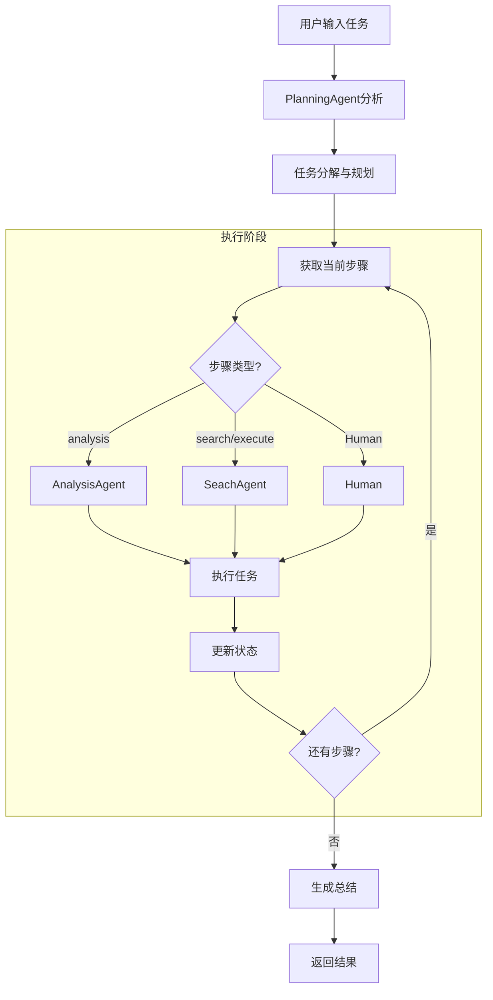

```mermaid
flowchart TD
    A[用户输入任务] --> C[PlanningAgent分析]
    C --> D[任务分解与规划]
    D --> H[获取当前步骤]
    subgraph 执行阶段
    H --> I{步骤类型?}
    I -->|analysis| J[AnalysisAgent]
    I -->|search/execute| L[SeachAgent]
    I -->|Human| K[Human]
    J --> M[执行任务]
    L --> M
    K --> M
    M --> N[更新状态]
    N --> O{还有步骤?}
    O -->|是| H
    end
    O -->|否| P[生成总结]
    P --> Q[返回结果]
```