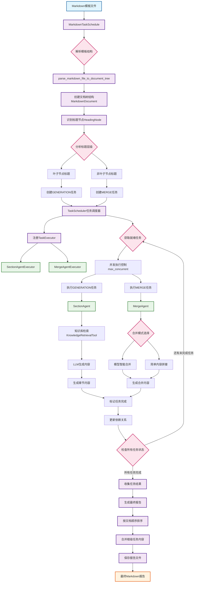
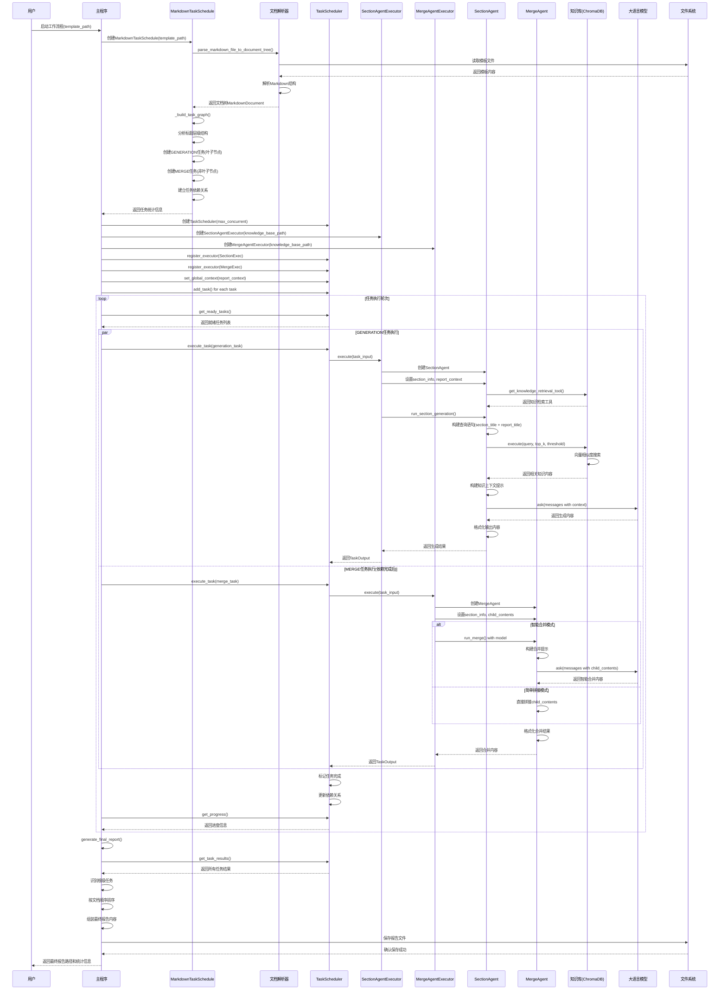

# Template Agent Workflow - 从文档输入到报告生成流程图

本流程图展示了基于TaskScheduler的完整工作流程，从Markdown模板输入到最终报告生成的全过程。

## 工作流程详细说明

### 1. 文档输入阶段
- **输入**: Markdown模板文件（如企业信贷评估模板.md）
- **解析**: 使用`parse_markdown_file_to_document_tree`解析文档结构
- **构建**: 创建包含标题层级关系的文档树

### 2. 任务生成阶段
- **叶子节点**: 没有子标题的节点创建`GENERATION`任务
- **非叶子节点**: 有子标题的节点创建`MERGE`任务
- **依赖关系**: 基于文档层级结构建立任务依赖

### 3. 任务调度阶段
- **调度器**: `TaskScheduler`管理任务执行顺序
- **并发控制**: 通过`max_concurrent`参数控制并发数
- **执行器注册**: 
  - `SectionAgentExecutor`: 处理内容生成任务
  - `MergeAgentExecutor`: 处理内容合并任务

### 4. 内容生成执行
- **SectionAgent**: 负责具体章节内容生成
  - 使用知识库检索相关信息
  - 通过LLM生成结构化内容
  - 按照模板格式要求输出

### 5. 内容合并执行
- **MergeAgent**: 负责子章节内容合并
  - **智能合并**: 使用LLM理解语义进行合并
  - **简单拼接**: 直接连接子内容（性能更好）

### 6. 报告生成阶段
- **结果收集**: 收集所有完成任务的内容
- **排序**: 按原始文档顺序排列内容
- **合并**: 组装成最终的Markdown报告
- **输出**: 保存到指定目录

## 关键特性

1. **并发执行**: 支持多任务并行处理，提高效率
2. **依赖管理**: 自动处理任务间依赖关系
3. **错误处理**: 任务失败时提供错误信息，不影响其他任务
4. **灵活配置**: 支持不同的知识库路径和合并策略
5. **进度跟踪**: 实时显示任务执行进度和统计信息

## 核心组件

- **TaskScheduler**: 任务调度核心，负责依赖解析和并发控制
- **SectionAgent**: 内容生成智能体，集成知识检索和LLM生成
- **MergeAgent**: 内容合并智能体，支持智能和简单两种合并模式
- **MarkdownTaskSchedule**: 文档解析器，将Markdown转换为任务图

---

## 时序图 - 完整处理流程

以下序列图展示了从模板输入、知识库构建到生成最终报告的详细时序过程：

### 时序图关键说明

#### 1. 模板解析阶段 (Lines 5-15)
- 解析Markdown模板文件为文档树结构
- 识别标题层级和内容组织

#### 2. 任务图构建阶段 (Lines 16-23)
- 叶子节点创建GENERATION任务
- 非叶子节点创建MERGE任务
- 建立基于文档结构的依赖关系

#### 3. 调度器初始化 (Lines 24-33)
- 注册SectionAgentExecutor和MergeAgentExecutor
- 设置全局上下文和并发控制

#### 4. 并发任务执行 (Lines 36-73)
- **GENERATION任务**: 知识检索 → LLM生成 → 格式化输出
- **MERGE任务**: 等待依赖完成 → 智能/简单合并 → 输出结果
- 支持并发执行以提高效率

#### 5. 知识库交互 (Lines 47-52)
- 使用ChromaDB进行向量相似度搜索
- 基于查询语句检索相关文档片段
- 为LLM提供上下文信息

#### 6. 智能体协作模式
- **SectionAgent**: 专注单个章节生成，集成知识检索
- **MergeAgent**: 专注内容合并，支持智能和简单两种模式
- 每个智能体独立工作但通过TaskScheduler协调

#### 7. 最终报告生成 (Lines 75-84)
- 收集所有完成任务的结果
- 按原始文档顺序重新组织
- 生成结构化的Markdown报告